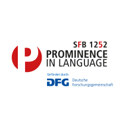
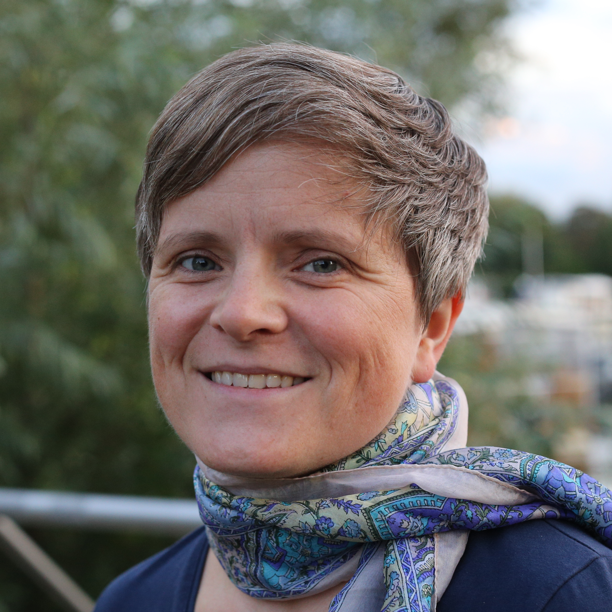
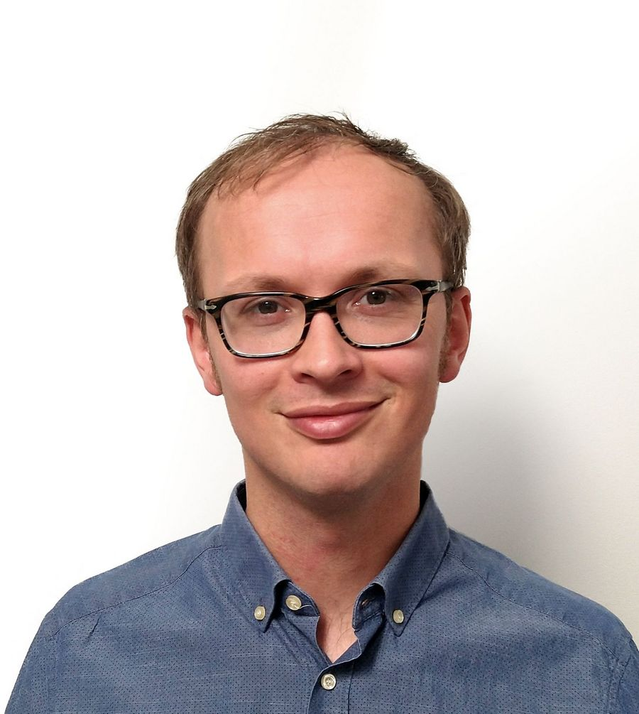
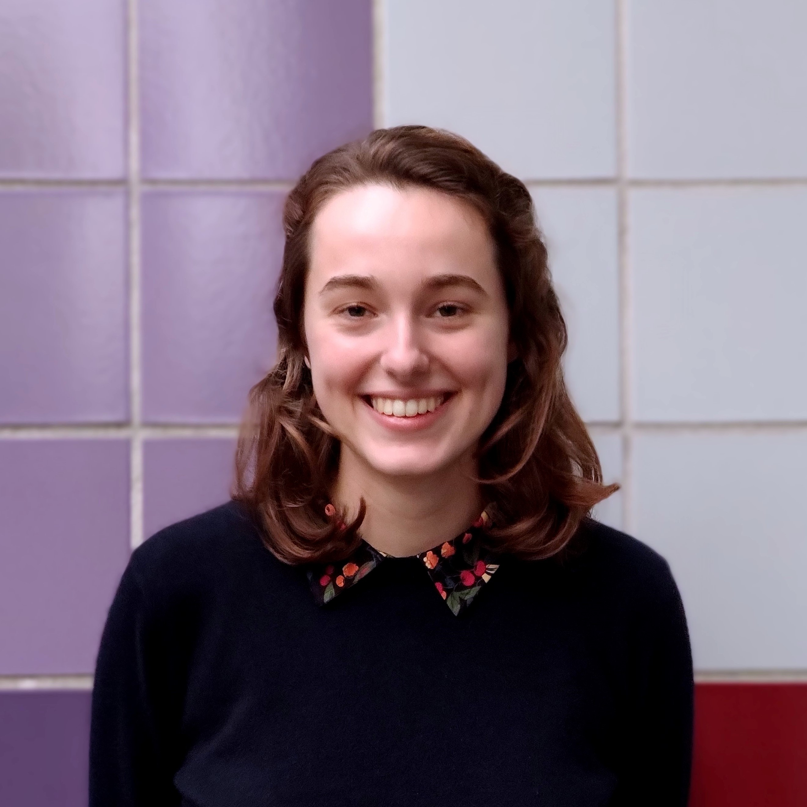
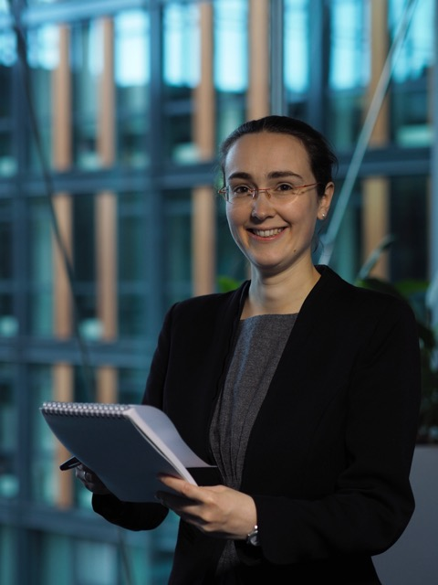
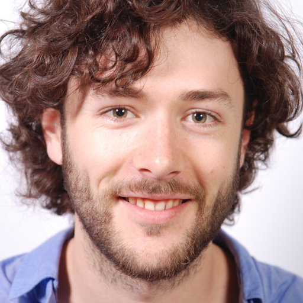
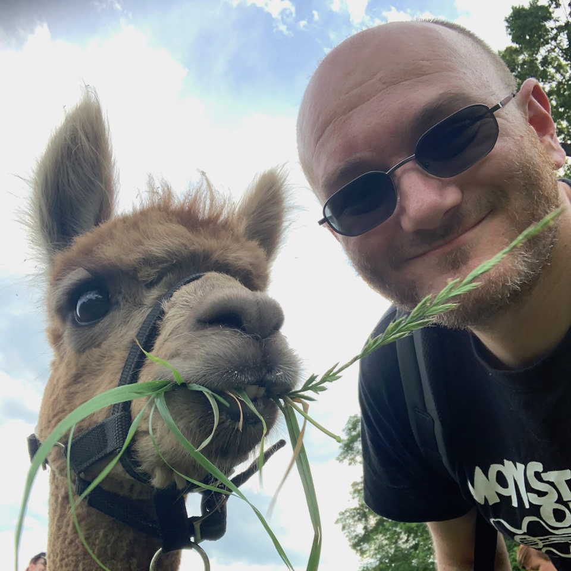

# Large Language Models for Linguistic Analyses: Applications and Limitations

**24–25 November 2025 | University of Cologne**

**A Workshop organised by the SFB/CRC 1252: Prominence in Language**

We invite you for a two-day workshop exploring the applications, challenges, and implications of using Large Language Models (LLMs) in linguistic research.

This workshop brings together researchers of all career stages to discuss how LLMs can be used as tools for e.g. automatic annotation, text analysis, stimulus generation, while critically considering their cognitive plausibility and inherent biases.

Two important applications of LLMs include using LLMs as tools for linguistic research and using LLMs as cognitive models of language processing. This workshop will focus on using LLMs as tools all the while acknowledging that this requires us to critically consider their cognitive and psycholinguistic plausibility. How can LLMs be used as tools for automatic annotation, text analysis, generation, etc.? What are the cognitive and psycholinguistic implications of LLM-based language processing? What biases do LLMs introduce, and how can we deal with biases in automated linguistic analyses?

<figure markdown>
  { width="600" }
  <figcaption>LLM Workshop Poster - Click to enlarge</figcaption>
</figure>

## Important Dates
- Call for Posters: Open until October 15, 2025
- Registration: Open until October 15, 2025
- Workshop: November 24-25, 2025

## Invited Speakers

  

    
    
<strong>Tatjana Scheffler</strong> Ruhr University Bochum <a href="http://staff.germanistik.rub.de/digitale-forensische-linguistik/">Homepage</a>

  

  

    
    
<strong>Mark Dingemanse</strong> Radboud University Nijmegen <a href="https://markdingemanse.net/">Homepage</a>

  

  

    
    
<strong>Sam Boeve</strong> University of Ghent <a href="https://research.ugent.be/web/person/sam-boeve-0/en">Homepage</a>

  

  

    
    
<strong>Charlotte Pouw</strong> University of Amsterdam <a href="https://www.illc.uva.nl/People/Table/person/5440/Charlotte-Pouw">Homepage</a>

  

## Call for Posters

**Workshop: Large Language Models for Linguistic Analyses: Applications and Limitations**
**24–25 November 2025 | University of Cologne**

The workshop is designed around a central poster session to exchange ideas and discussion. We explicitly invite submissions from students and researchers across all career stages. We also explicitly welcome posters that present work in progress and new ideas. 

We invite poster submissions on any topic related to the use of LLMs in the language and cognitive sciences, including but not limited to:

- Methodological and theoretical challenges: e.g. reproducibility, good research and open science practices, evaluating LLM output.
- Cognitive and psycholinguistic implications of LLM-based language processing.
- Identifying and mitigating biases in LLMs for linguistic analysis.
- Using LLMs as tools for automatic annotation (e.g., phonetic, syntactic, discourse-level).
- LLM-based text, speech, or gesture analysis.
- Using LLMs for automatic stimulus generation or data augmentation.
- Using LLMs for studying cognitive and linguistic phenomena such as prominence.

To present a poster, please submit a title by **October 15, 2025** using the registration form below.

We also ask all participants to register by **October 15, 2025** using the same registration form below.

This workshop is organized by the **Collaborative Research Center (CRC) 1252 "Prominence in Language"** at the University of Cologne. We are committed to creating an inclusive and collaborative environment.

We look forward to seeing you!

## Poster Presentations

- **"Triangulating Related-Language Models for Assisted Transcription in Low-Resource Languages (co-author: Mark Ellison)"**  
  *Amalia Canes-Nápoles* (University of Cologne, Institute für romanische Sprachen und Literaturen, Institut für deutsche Sprache und Literatur I)

- **"Investigating linguistic alignment with behaviourally modified chatbots: Design and exploratory analyses"**  
  *Paul Compensis* (University of Bamberg, Institute of Psychology)

- **"Using LLMs to determine the combinatorial semantics of Spanish adjective-noun collocations"**  
  *Eric Engel* (University of Cologne, Department of Romance Studies)

- **"Who is the Pronoun Pro? Comparing LLMs and trained human annotators in pronoun resolution."**  
  *Carlos Hartmann* (Universität Zürich)

- **"Simulating Human Judgments: The Potential of LLMs in Linguistic Experiments on Prominence"**  
  *Jürgen Hermes* (University of Cologne, Department of Digital Humanities)

- **"Cross-linguistic comparisons of children’s linguistic input using language models"**  
  *Eva Huber* (University of Cologne, Department of Linguistics)

- **"Bias in Large Language Models: Investigating Morphosyntactic Features of African American English and Indian English"**  
  *Rose Hörsting* (University of Cologne)

- **"Genus-sexus congruence in machine translation: DeepL’s pronominal resumption of ‘das Mädchen’"**  
  *Tiziana Ilie* (University of Cologne, Romance Dept., Dept. of Linguistics) (collab. with Dr. Elen Le Foll)

- **"Referential choice in direct speech: Replicating an experiment with an LLM"**  
  *Katja Jasinskaja* (University of Cologne, IdSL I)

- **"Neural Modelling: Can We Map Human Cognition onto (and with) an LLM?"**  
  *Ahmet Şadan Kutay Kendirli* (University of Cologne, Linguistics (MA))

- **"Detecting Gender Bias in Transformer Embeddings: A Systematic Review"**  
  *Eirik Lidsheim Erdal* (Radboud University, Centre for Language Studies)

- **"Using Large Language Models to Perform MIPVU-Inspired Automatic Metaphor Detection"**  
  *Sebastian Reimann* (Ruhr University Bochum)

- **"Detecting Gender Bias in Transformer Embeddings: A Systematic Review"**  
  *Michelle Vuong* (Goethe University Frankfurt, University of Cologne)

- **"The written language bias in automatic transcription"**  
  *Eva Windbergs* (University of Cologne, Department of Linguistics)

- **"LLMs as Models of Whose Language? A Longitudinal Comparison of Child and LLM-generated German Corpora"**  
  *Hanna Woloszyn* (University of Cologne)

- **"Scaling behavior in LLMs as tools for modeling human word and sentence processing"**  
  *Job Schepens* (University of Cologne)

## Registration

To register for the workshop, please fill out the registration form below.

Registration is handled through a survey.uni-koeln form.

[Register for the Workshop](https://survey.uni-koeln.de/index.php/612595?lang=en)

- **Deadline**: October 15, 2025
- **Fee**: Free (funded by CRC 1252)
- **Location**: University of Cologne, Neue Senaatssaal, Albertus-Magnus-Platz, 50923 Köln, Germany

For poster submissions, use the same form and indicate your interest in presenting.

If you encounter any issues or need assistance, please contact: job.schepens@uni.koeln.de

## Workshop Schedule

### Day 1: Monday, November 24, 2025

- **11:30 - 12:30**: An Introduction to Large Language Models: LLMs 101  
  Speaker: <a href="https://nilsreiter.de/">Prof. Dr. Nils Reiter</a> (University of Cologne)

- **14:00 - 14:05**: Welcome & Workshop Overview
  Organizers

- **14:05 - 14:50**: Talk 1: "Linguistic analysis with LLMs? The case of discourse and pragmatics"  
  Speaker: <a href="http://staff.germanistik.rub.de/digitale-forensische-linguistik/">Prof. Dr. Tatjana Scheffler</a> (Ruhr University Bochum) |
  <a href="speakers/tatjana-scheffler">Abstract</a> | <a href="http://staff.germanistik.rub.de/digitale-forensische-linguistik/">Homepage</a>

- **14:50 - 15:35**: Talk 2: "What makes LLMs so irresistible?"  
  Speaker: <a href="https://markdingemanse.net/">Prof. Dr. Mark Dingemanse</a> (Radboud University Nijmegen) |
  <a href="speakers/mark-dingemanse">Abstract</a> | <a href="https://markdingemanse.net/">Homepage</a>

- **15:45 - 17:30**: Poster Session & Networking 
  * Poster Teasers (2-minute presentations)
  * Interactive Poster Session with Coffee and Snacks

- **19:00 - 21:30**: Workshop Dinner in <a href="https://balthasar-cafe.de/">Cafe Balthasar</a>

### Day 2: Tuesday, November 25, 2025

- **09:00 - 09:45**: Talk 3: "Interpreting models for speech generation and understanding using methods from psycholinguistics"
  Speaker: <a href="https://www.illc.uva.nl/People/Table/person/5440/Charlotte-Pouw">Charlotte Pouw</a> (University of Amsterdam) |
  <a href="speakers/charlotte-pouw">Abstract</a> | <a href="https://www.illc.uva.nl/People/Table/person/5440/Charlotte-Pouw">Homepage</a>

- **09:45 - 10:30**: Talk 4: "From Tool to Theory: LLMs in Psycholinguistics"  
  Speaker: <a href="https://research.ugent.be/web/person/sam-boeve-0/en">Sam Boeve</a> (Ghent University) |
  <a href="speakers/sam-boeve">Abstract</a> | <a href="https://research.ugent.be/web/person/sam-boeve-0/en">Homepage</a>

- **10:30 - 11:00**: Coffee Break

- **11:00 - 12:15**: Panel: Critical Perspectives on Ethics, Bias, and Responsible AI in Linguistics  
  Panelists: <a href="https://research.ugent.be/web/person/sam-boeve-0/en">Sam Boeve</a>, <a href="https://markdingemanse.net/">Mark Dingemanse</a>, <a href="https://tscheffler.github.io/">Tatjana Scheffler</a>, <a href="https://elenlefoll.eu/">Elen Le Foll</a> (Moderation)

- **12:15 - 12:30**: Open Discussion with Audience

- **12:30 - 14:00**: Open End with Snacks & Networking

## About the CRC 1252 "Prominence in Language"
This workshop is funded by the Collaborative Research Center (CRC) 1252 "Prominence in Language" at the University of Cologne. The CRC investigates how prominence is expressed and processed across different linguistic levels, from phonetics to discourse.

We are committed to creating an inclusive and collaborative environment. If you have any concerns about participation or need additional support to attend, please let us know.

## Organizers

  

    
    
<strong>Elen Le Foll</strong> University of Cologne <a href="https://elenlefoll.eu/">Homepage</a>

  

  

    
    
<strong>Job Schepens</strong> University of Cologne <a href="https://scholar.google.com/citations?user=4S18kYgAAAAJ&hl=en">Google Scholar</a>

  

  

    
    
<strong>Mark Ellison</strong> University of Cologne <a href="https://scholar.google.com/citations?user=wemAjQoAAAAJ&hl=en">Google Scholar</a>

  

  

    
    
<strong>Nils Reiter</strong> University of Cologne <a href="https://nilsreiter.de/">Homepage</a>

  

For any questions, please contact us at: **job.schepens@uni.koeln.de**
