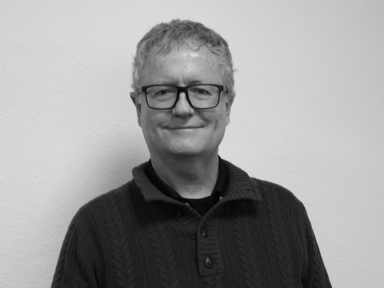
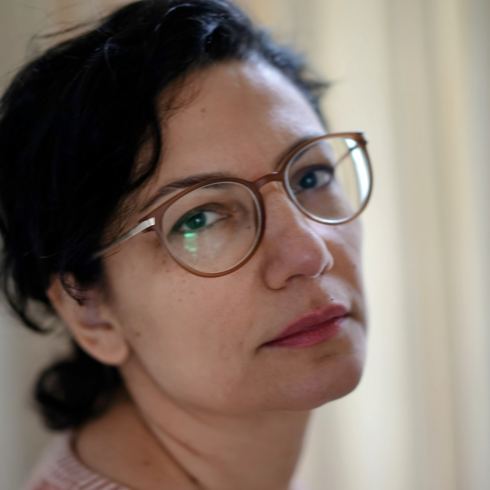

# Large Language Models for Linguistic Analyses: Applications and Limitations

**24–25 November 2025 | University of Cologne**
**A Workshop organised by the SFB/CRC 1252: Prominence in Language**

Large Language Models (LLMs) offer new ways for automatic text, speech, and gesture annotation, analysis, and generation. This two-day workshop brings together researchers of all career stages to explore the practical applications, methodological challenges, and theoretical implications of using LLMs for linguistic research.

Two important applications of LLMs include using LLMs as tools for linguistic research and using LLMs as cognitive models of language processing. This workshop will focus on using LLMs as tools all the while acknowledging that this requires us to critically consider their cognitive and psycholinguistic plausibility. How can LLMs be used as tools for automatic annotation, text analysis, generation, etc.? What are the cognitive and psycholinguistic implications of LLM-based language processing? What biases do LLMs introduce, and how can we deal with biases in automated linguistic analyses?

We have invited 4 speakers from computational linguistics, psycholinguistics, and digital humanities. They bring in expertise on psycholinguistic evaluation methods (Sam Boeve), transformer limitations and theoretical foundations (Afra Alishahi), reproducibility (Mark Dingemanse), and corpus linguistics (Tatjana Scheffler).

## Organizers

  

    
    
<strong>Nils Reiter</strong> University of Cologne

  

  

    
    
<strong>Elen Le Foll</strong> University of Cologne

  

  

    
    
<strong>Job Schepens</strong> University of Cologne

  

  

    
    
<strong>Mark Ellison</strong> University of Cologne

  

## Invited Speakers

  

    
    
<strong>Tatjana Scheffler</strong> Ruhr University Bochum

  

  

    
    
<strong>Mark Dingemanse</strong> Radboud University Nijmegen

  

  

    
    
<strong>Afra Alishahi</strong> Tilburg University

  

  

    
    
<strong>Sam Boeve</strong> University of Ghent

  

## Important Dates
- Call for Posters: Open until October 10, 2025
- Workshop: November 24-25, 2025

## Navigation
- [Schedule](#workshop-schedule)
- [Call for Posters](#call-for-posters)
- [Registration](#registration)

## Workshop Schedule

### Day 1: Monday, November 24, 2025

- **11:30 - 12:30**: LLMs 101
  Speaker: Prof. Dr. Nils Reiter (University of Cologne)

- **14:00 - 14:05**: Welcome & Workshop Overview
  Organizers

- **14:05 - 14:50**: Talk 1
  Speaker: Prof. Dr. Tatjana Scheffler (Ruhr University Bochum)

- **14:50 - 15:35**: Talk 2
  Speaker: Prof. Dr. Mark Dingemanse (Radboud University Nijmegen)

- **15:45 - 17:30**: Poster Session & Networking
  * Poster Teasers (2-minute presentations)
  * Interactive Poster Session with Coffee and Snacks

- **19:00 - 21:30**: Workshop Dinner

### Day 2: Tuesday, November 25, 2025

- **09:00 - 09:45**: Talk 3
  Speaker: Dr. Afra Alishahi (Tilburg University)

- **09:45 - 10:30**: Talk 4
  Speaker: Sam Boeve (University of Ghent)

- **11:00 - 12:15**: Panel: Critical Perspectives on Ethics, Bias, and Responsible AI in Linguistics
  Panelists: Sam Boeve, Mark Dingemanse, Tatjana Scheffler, Afra Alishahi, Elen Le Foll (Moderation)

- **12:15 - 12:30**: Open Discussion with Audience

- **12:30 - 14:00**: Open End with Snacks & Networking

### About the CRC 1252 "Prominence in Language"
This workshop is funded by the Collaborative Research Center (CRC) 1252 "Prominence in Language" at the University of Cologne. The CRC investigates how prominence is expressed and processed across different linguistic levels, from phonetics to discourse.

We are committed to creating an inclusive and collaborative environment. If you have any concerns about participation or need additional support to attend, please let us know.

## Call for Posters

**Workshop: Large Language Models for Linguistic Analyses: Applications and Limitations**
**24–25 November 2025 | University of Cologne**

We invite you for a two-day workshop exploring the applications, challenges, and implications of using Large Language Models (LLMs) in linguistic research.

This workshop brings together researchers of all career stages to discuss how LLMs can be used as tools for e.g. automatic annotation, text analysis, stimulus generation, while critically considering their cognitive plausibility and inherent biases.

Our invited speakers bring diverse expertise with talks from:

- Prof. Dr. Tatjana Scheffler (Ruhr University Bochum)
- Prof. Dr. Mark Dingemanse (Radboud University Nijmegen)
- Dr. Afra Alishahi (Tilburg University)
- Sam Boeve (University of Ghent)

The workshop is designed with a poster session at the center. We explicitly invite submissions from students and researchers across all career stages. We are also explicitly welcoming posters that present work in progress and new ideas. There will not be a formal review process.

We invite poster submissions on any topic related to the use of LLMs in language and cognitive sciences, including but not limited to:

- Methodological and theoretical challenges: e.g. reproducibility, good research and open science practices, evaluating LLM output.
- Cognitive and psycholinguistic implications of LLM-based language processing.
- Identifying and mitigating biases in LLMs for linguistic analysis.
- Using LLMs as tools for automatic annotation (e.g., phonetic, syntactic, discourse-level).
- LLM-based text, speech, or gesture analysis.
- Using LLMs for automatic stimulus generation or data augmentation.
- Using LLMs for studying cognitive and linguistic phenomena such as prominence.

To present a poster, please submit a title by **October 10, 2025** using [this registration form](https://survey.uni-koeln.de/index.php/612595?lang=en).

This workshop is organized by the **Collaborative Research Center (CRC) 1252 "Prominence in Language"** at the University of Cologne. We are committed to creating an inclusive and collaborative environment.

We look forward to seeing you!

For any questions, please contact us at: **job.schepens@uni.koeln.de**

Warm regards,
Dr. Job Schepens, Prof. Dr. Nils Reiter, Dr. Elen Le Foll, Dr. T. Mark Ellison
SFB 1252 "Prominence in Language"
University of Cologne

## Registration

To register for the workshop, please fill out the registration form below.

Since this is a static website, registration is handled through an external Google Form for data collection.

[Register for the Workshop](https://survey.uni-koeln.de/index.php/612595?lang=en)

### Registration Details
- **Deadline**: October 31, 2025
- **Fee**: Free (funded by CRC 1252)
- **Location**: University of Cologne

For poster submissions, use the same form and indicate your interest in presenting.

If you encounter any issues or need assistance, please contact: job.schepens@uni.koeln.de